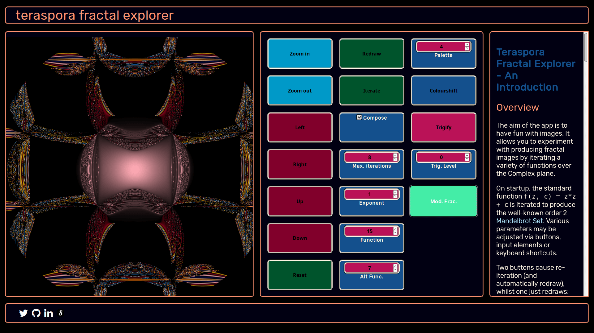
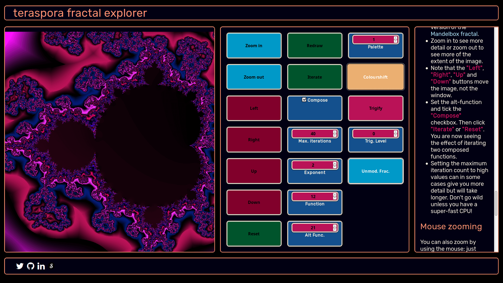
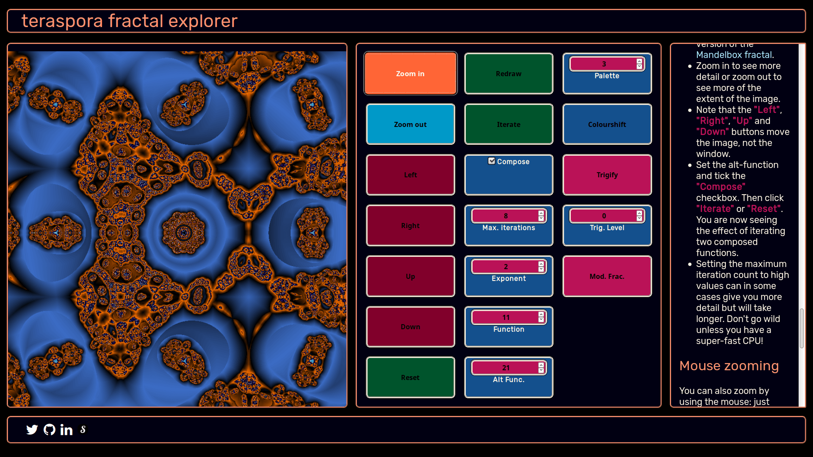
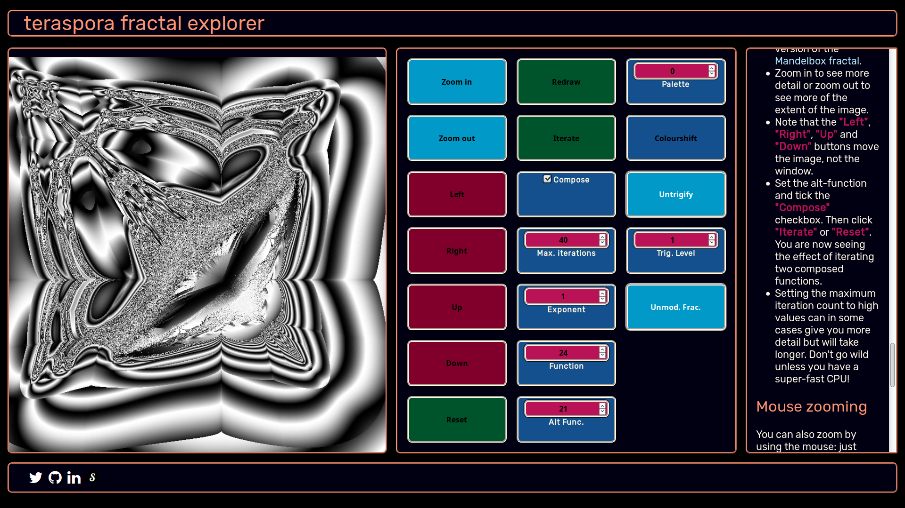

# Teraspora Fractal Explorer

## Introduction

This little Javascript app allows the user to generate interesting images by iterating functions over the complex plane, stopping iteration if the magnitude of the number or the number of iterations exceed pre-defined values.   In order to obviate sharp colour bands, which purely integer iteration counts would give, the count is modified according to how far out a point escapes, or if it doesn't, then how far inside the escape radius it is on the last iteration. This then results in gradations of shading when the colours are interpolated.

Such images are known as "Escape-time fractals", and the classic example is the well-known Mandelbrot Set, which is obtained by iterating the function 
`f(z): z -> z * z + c where z, c &‌#8946; &‌#8450;`.   If we set `c` to the initial value of z for each pixel, i.e. the Complex number to which that pixel maps, we get the Mandelbrot Set for the function.   If we set `c` corresponding to a particular pixel, the same value for every pixel we iterate, then we get the Julia Set of the function for that point.

To see how the structure of the Julia set varies as we go around the border of the standard Mandelbrot set, see my video <a href="https://www.youtube.com/embed/GTTlYxDHjtc">Julia Trip</a>. 

Such sets are called fractals because they exhibit an infinite level of detail (subject, of course, to hardware limitations and the precision of floats) and show self-similarity at different scales. To get an idea of this see <a href="https://www.shadertoy.com/embed/MlGcDw?gui=true&t=10&paused=false&muted=false">my shader which zooms into the standard order 2 Mandelbrot Set</a>.

I started programming escape-time fractals a few years ago in Java 8 with JavaFX, and I continue to develop this program, which I used to produce the "Julia Trip" video.

So to create the engine of this app, I basically translated the core engines of my Java app into Javascript, manually - also having to translate the functions to iterate from Java lambdas and replace <a href="https://github.com/teraspora/Complex">my Java Complex Number class</a> by Javascript functions.   Also, in the Java program I parallelise the iterations using one of the native parallel Stream functions, thus:
`IntStream.range(0, width * height).parallel().forEach(pixel -> iterate(pixel));`
and use four threads to set the colours in the four quadrants, but I have not yet learnt how to do this in Javascript.   However, I hope this to be a future enhancement, using "Web workers", I think, as currently this version is considerably slower than JVM Bytecode.

We might decide that we&#39;ll do a maximum of 32 iterations and we&#39;ll stop iterating if the value goes outside a circle of radius 4 centred on the origin (remember we&#39;re in the complex plane).   A number z = x + iy is outside the circle if and only if x2 + y2 &gt; 16, so we can easily test for this.

## UX
 
The purpose of the app is just the fun of seeing the interesting images that composed functions can produce, and the fun of exploring the hidden detail within some fractals.

The typical user will use the app for destressing, relaxing for a few minutes, enjoying coloured images as a change from a grey world for example, just as they might play a video game, but without the competitive element.

## Features

The aim of the app is to have fun with fractal images. 

It allows you to experiment with producing fractal images by iterating a variety of functions over the Complex plane.

On startup, the standard function <code>f(z, c) = z*z + c</code> is iterated to produce the well-known order 2 <a target="_blank" href="https://en.wikipedia.org/wiki/Mandelbrot_set">Mandelbrot Set</a>.
Various parameters may be adjusted via buttons, input elements or keyboard shortcuts.   

Two buttons cause re-iteration (and automatically redraw), whilst one just redraws:

<ul>
<li><strong>&quot;Iterate&quot;</strong> just reiterates the function(s) and redraws based on current values of parameters.</li>
<li><strong>&quot;Reset&quot;</strong> also resets the zoom levels and the x and y offsets.</li>
<li><strong>&quot;Redraw&quot;</strong> causes a redraw based on the currently stored iteration count array with any newly altered colour settings.</li>
</ul>

Some parameters, i.e. the index/indices of the function(s) being iterated, the order (exponent), the maximum number of iterations per pixel, the zoom level and the x and y offsets, affect the iteration.   Any change in these and you&#39;ll need to hit <strong>&quot;Iterate&quot;</strong> or <strong>&quot;Reset&quot;</strong> to see the changes.

Others, i.e. the colour palette in use, the amount the palette is shifted, the level of <em>trigification</em>, and a parameter which modifies the fractional part of the iteration count for a subtle effect, just affect the mapping of colours to iteration counts, and so only require a <strong>&quot;Redraw&quot;</strong> to see the results.

<strong>&quot;Mod. Frac&quot;</strong> and <strong>&quot;Trigify&quot;</strong> are Boolean switches, either on or off.   The text will always indicate the result of clicking, not the current state.

<strong>&quot;Trigify&quot;</strong> applies a function of my own devising which remaps the iteration counts.   Its effect may be varied with the <strong>&quot;Trigify Level&quot;</strong> selector.  Some images look better with this function applied.   Experimentation is the best guide.

<strong>&quot;Mod. Frac.&quot;</strong> remaps the fractional part of the iteration count (determined in the iteration phase by the distance inside or outside the escape radius on the last iteration) using the function <code>f(x) = sin(πx/2)</code>, which maps the unit interval to itself.   This can have subtle effects on how one colour blends into the next.   Again, please experiment!   In a future release I may introduce Hermite interpolation as an option. 

<h3>Functions</h3>

A number of functions are provided for the user to experiment with, including the standard Mandelbrot, the Burning Ship fractal, a version of the 2D <a target="_blank" href="https://en.wikipedia.org/wiki/Mandelbox">Mandelbox fractal</a> and a bunch of largely trigonometric functions of my own devising.   Note that I take sines and cosines of the real and imaginary components separately:  I don&#39;t use the Complex versions of these functions as in my experience they tend to produce fractured images.

More functions will be included in a future version.

When <strong>&quot;Compose&quot;</strong> is ticked, functions are composed, thus, if <strong>&quot;Function&quot;</strong> is <code>f(z, c)</code> and <strong>&quot;Alt Func.&quot;</strong> is <code>g(z, c)</code> then composing functions results in <code>f(g(z, c), c)</code> being iterated. 

Note that the user can also vary the associated exponent to see the effects higher-order functions have upon the image.

<h3>Colour palettes</h3>

All palettes consist of colours alternating with black, which can result in nice shading that gives a quasi-3D effect.

<h3>Get started</h3>

<strong>Just play!</strong>

<ul>
<li>Change the exponent to see higher-order Mandelbrot sets.</li>
<li>Experiment with colour palettes, trigification, fraction modification and palette shifting.</li>
<li>Change the exponent back to 2 and the function index to 2 and you will get the famous <a target="_blank" href="https://en.wikipedia.org/wiki/Burning_Ship_fractal">Burning Ship Fractal</a>.</li>
<li>Change the function index to 11, 12, 13 or 14 and you will get a version of the <a target="_blank" href="https://en.wikipedia.org/wiki/Mandelbox">Mandelbox fractal</a>.</li>
<li>Zoom in to see more detail or zoom out to see more of the extent of the image.</li>
<li>Note that the <strong>&quot;Left&quot;</strong>, <strong>&quot;Right&quot;</strong>, <strong>&quot;Up&quot;</strong> and <strong>&quot;Down&quot;</strong> buttons move the image, not the window.</li>
<li>Set the alt-function and tick the <strong>&quot;Compose&quot;</strong> checkbox.   Then click <strong>&quot;Iterate&quot;</strong> or <strong>&quot;Reset&quot;</strong>.   You are now seeing the effect of iterating two composed functions.</li>
<li>Setting the maximum iteration count to high values can in some cases give you more detail but will take longer.   Don&#39;t go wild unless you have a super-fast CPU!</li>
</ul>
<h3>Mouse zooming</h3>

You can also zoom by using the mouse:  just drag with the primary mouse button on from the top-left corner to the bottom-right corner of the square you&#39;d like to enlarge.

<h3>Julia Sets</h3>

Each point of the Mandelbrot set (or of any set thus created with the escape-time method) corresponds to a <a target="_blank" href="https://en.wikipedia.org/wiki/Julia_set">Julia Set</a>, and by clicking on a point you can view its Julia Set.
Click again to go back to the Mandelbrot (or its generalisation).

<h3>Keyboard Shortcuts</h3>
<table>
<thead>
<tr>
<th>Shortcut</th>
<th>Button equivalent</th>
</tr>
</thead>
<tbody>
<tr>
<td>SPACE</td>
<td>Iterate</td>
</tr>
<tr>
<td>/</td>
<td>Redraw</td>
</tr>
<tr>
<td>+  or =</td>
<td>Zoom in</td>
</tr>
<tr>
<td>-</td>
<td>Zoom out</td>
</tr>
<tr>
<td>z</td>
<td>Reset</td>
</tr>
<tr>
<td>c</td>
<td>Toggle Compose</td>
</tr>
<tr>
<td>t</td>
<td>Toggle Trigify</td>
</tr>
<tr>
<td>m</td>
<td>Toggle Modify Fraction</td>
</tr>
</tbody>
</table>

Enjoy!

	I use CSS Grid to style the app.   Between a Title Bar and a footer bar are three panels, containing the canvas to draw upon, the control panel with buttons and input elements, and a <strong>&quot;Help&quot;</strong> panel.

	The <strong>&quot;Control Panel&quot;</strong> itself also uses CSS Grid to lay out the buttons and input elements.

### Features Left to Implement
- Make it respond better on mobile

## Technologies Used

- [Javascript / ECMAScript](https://www.ecma-international.org/ecma-262/9.0/index.html)
    - The project uses **Javascript** for its functionality.
- [HTML5](https://www.w3.org/TR/html52/)
	- The project uses **HTML5** for its structure.
- [CSS3](https://www.w3.org/Style/CSS/Overview.en.html)
	- The project uses **CSS3** for its styling.
- The project targets the HTML5 Canvas, which satisfies the requirement to include "JavaScript code that uses external and/or internal APIs (e.g. TMDb, Google Maps, Canvas, dc.js, etc.) in an effective manner."

## Testing

It was tested continually as I developed it, in Firefox Developer Edition(64-bit) and Chromium, using both Firefox and Chromium developer tools, and nearing the conclusion of the project also on other physical devices.

I used responsive mode in the dev tools and resizing the viewport to find unwanted behaviour so as to correct it. I also periodically checked the appearance on both my phone and tablet (both Android) in Chrome and Dolphin browsers.

It is in the nature of such an application that it is very difficult to precisely verify that fractals generated are exactly as intended, but I was able to cross-check some results visually against images generated by my Java program.

Testing in the W3C HTML Validator:

Testing my CSS in the Jigsaw validator:

### Interesting Bugs

If I refresh the page, the browser retains previously input values in input elements like "Colour Palette", although they are initialised at the start of my script.   Some issue with caching, I guess...

I have had quite some difficulty with the CSS layout.   The Javascript code, though it may appear complex, gave me no significant or insoluble problems, but I find CSS positioning and sizing quite difficult and unintuitive.

I am pleased to say, though, that following my detailed suggestion, Wes Bos and Scott Tolinski have devoted a whole episode of their excellent  

## Deployment

I pushed my local git repo of code, images and media to a Github repository, and enabled Github Pages for it. There is only one branch, master. URL of Home Page is <a target="_blank" href="https://teraspora.github.io/fractal-explorer/">here</a>.

## Acknowledgements

### Algorithms

- Mandelbox definition / algorithm from <a href="https://en.wikipedia.org/wiki/Mandelbox">here</a>
- My algorithm for the fractional part of the colour index (based on how far
the final value of z is from the bailout circle) modified from
<a href="http://jussiharkonen.com/gallery/coloring-techniques">"On Smooth Fractal Coloring Techniques" by Jussi H¨ark¨onen</a> (Master’s Thesis, Dept. of Mathematics, °Abo Akademi University), available as .pdf.

